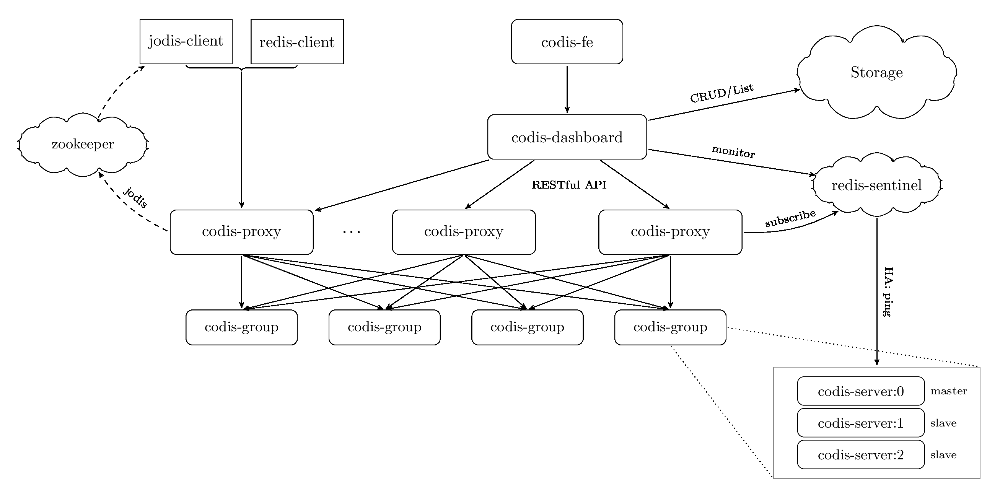

#### 介绍

Codis 是一个高性能的 Redis 集群解决方案，它用 slot 来划分用户 key，通过将 key 散列到不同分片来实现集群的 Scale-Out (横向扩展)。每个分片主从之间是 Redis 的复制协议，用户可以自己开发 Redis 复制组。

**架构**

我们从端上开始来看这个架构，业务通过 redis-cli 或者 jodis-client 可以直接连上 codis-proxy，codis-proxy 是无状态的，可以部署多个来扩展，同时 codis 将 codis-server 复制组划分到不同的 codis-group，并且将 key 通过 crc32 hash 到多个 slot 中，每个 codis-group 负责多个 slot 分片，slot 以及 codis-group 所维护的 redis 复制组信息都存储在 zookeeper 里面。codis-fe 是前台，codis-dashboard 是 codis 管理端，运维可以通过 codis-fe 来维护 codis 集群。关于 redis 复制组细节可以参考 << Redis 设计与实现 >> 一书。

