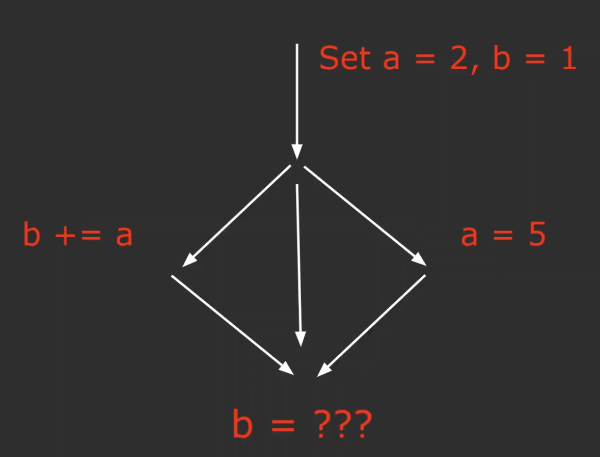
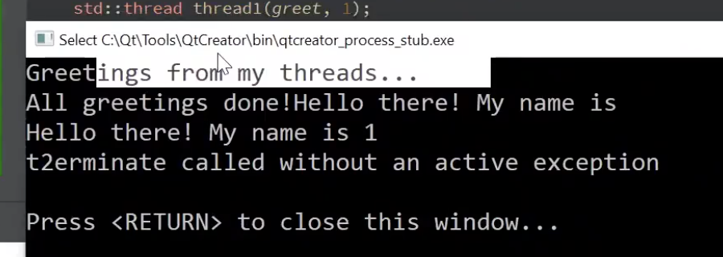
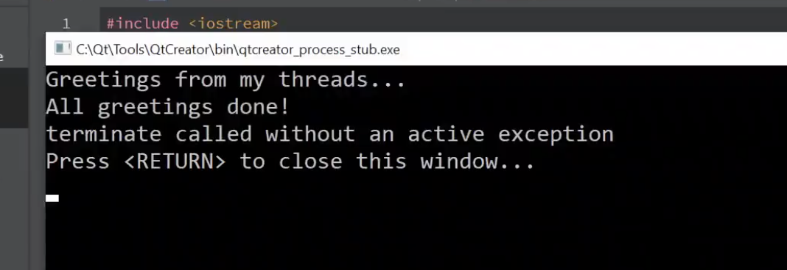
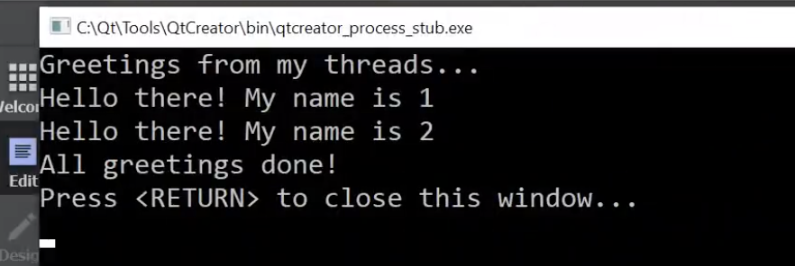

### what is a thread?

threads are ways to parallelise execution.



### STL Thread Lib

http://cplusplus.com/reference/multithreading/

Example1

```
// unique_lock example
#include <iostream>       // std::cout
#include <thread>         // std::thread
#include <mutex>          // std::mutex, std::unique_lock

std::mutex mtx;           // mutex for critical section

void print_block (int n, char c) {
  // critical section (exclusive access to std::cout signaled by lifetime of lck):
  std::unique_lock<std::mutex> lck (mtx);
  for (int i=0; i<n; ++i) { std::cout << c; }
  std::cout << '\n';
}

int main ()
{
  std::thread th1 (print_block,50,'*');
  std::thread th2 (print_block,50,'$');

  th1.join();
  th2.join();

  return 0;
}
```

!!! important topic

- use atomic types if doing multithreading!

- std::lock_guard vs. std::unique_lock

- 3 types of "locks"/mutexes: normal, timed, recursive

- condition varibles allow cross-thread communication

- std::async is one way to use multithreading


example 2

```

void greet(int id) {
    cout << "hello there! my name is: " << i << endl;
}

int main() {

    cout << "Greetings from my threads..." << endl;
    std::thread thread1(greet, 1);
    std::thread thread2(greet, 2);
    cout << "All greetings done!" << endl;

    return 0;
}

```

output



why ??


example 3

```

void greet(int id) {
    std::this_thread::sleep_for(std::chrono::seconds(5));
    cout << "hello there! my name is: " << i << endl;
}

int main() {

    cout << "Greetings from my threads..." << endl;
    std::thread thread1(greet, 1);
    std::thread thread2(greet, 2);
    cout << "All greetings done!" << endl;

    return 0;
}

```



because main thread exit before thead1 and thread2 call 'cout'.


example 4

```

std::mutex mtx;

void greet(int id) {
    std::lock_guard<std::mutex> lg(mtx);
    cout << "hello there! my name is: " << i << endl;
}

int main() {
    cout << "Greetings from my threads..." << endl;
    std::thread thread1(greet, 1);
    std::thread thread2(greet, 2);
    thread1.join();
    thread2.join();
    cout << "All greetings done!" << endl;
    return 0;
}

```




example 5

```

const size_t kNumThreads = 10;
std::mutex mtx;

void greet(int id) {
    std::lock_guard<std::mutex> lg(mtx);
    cout << "hello there! my name is: " << i << endl;
}

int main() {
    cout << "Greetings from my threads..." << endl;

    vector<std::thread> threads;
    for (size_t i = 0; i < kNumThreads; ++i) {
        threads.push_back(std::thread(greet, i));
    }

    // if not add &, will copy new thread
    for (std::thread& t : threads) {
        t.join();
    }

    cout << "All greetings done!" << endl;
    return 0;
}

```


