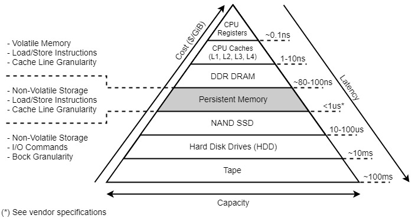
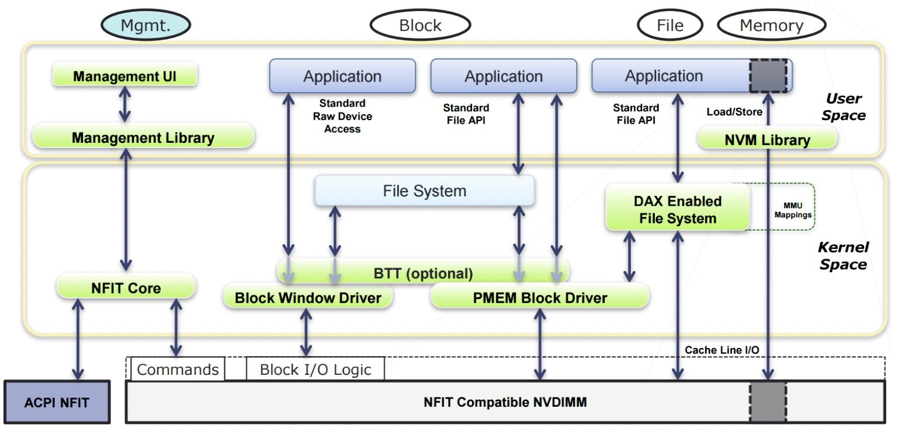
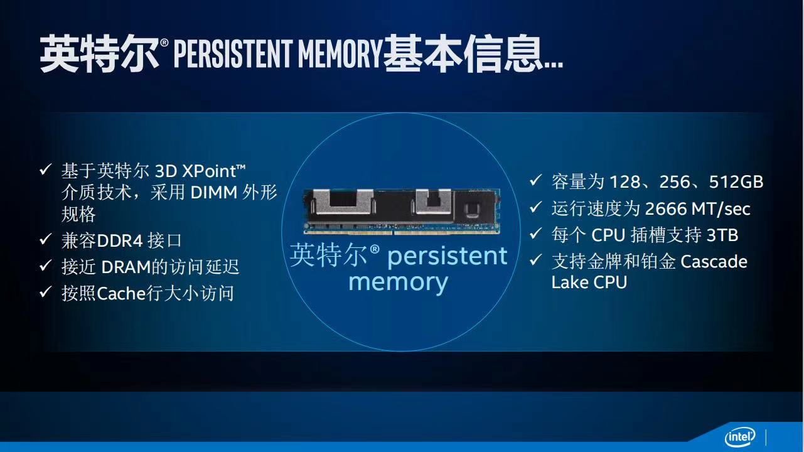
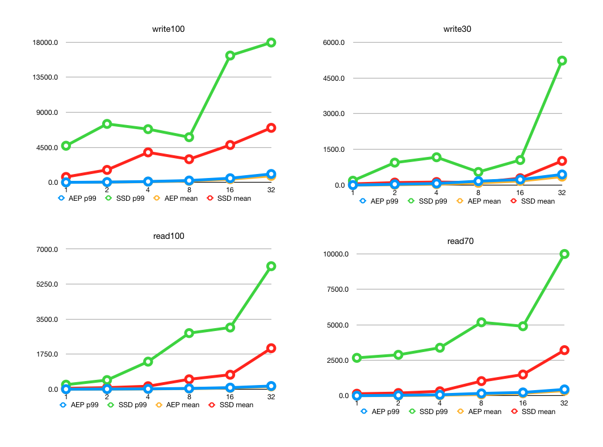
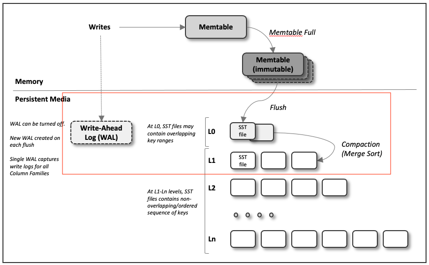

### **概述**

**Non-volatile memory** (**NVM**) 是一种新型的计算机内存，它可以持久化的保存数据，保证断电重启后数据仍然存在，同时性能能媲美通用 DRAM 内存。

上图是持久化内存在当前分层存储体系的位置

上图是 Intel 傲腾持久化内存 (AEP) 架构

它主要有下面两种工作模式：

1.**Memory Mode**：在这种模式下，DRAM+AEP一起呈现为大容量内存，总容量为AEP的容量，DRAM被用作cache，对系统不可见，注意这种模式下内存是非持久性的，即断电后内容就丢失。

2.**App Direct**模式：在这种模式下，AEP呈现为pmem持久性内存设备（/dev/pmem），系统看到的内存是DRAM，应用通过操作pmem设备来读写AEP。目前主流的文件系统ext4, xfs 都支持Direct Access的选项（-o dax), 当挂载完成后并且映射完地址空间后，读写就通过Load/Store的内存指令来进行，绕过了传统的文件系统或者块设备访问路径。

**持久化内存在存储体系的层次**

### 怎么搭建环境

#### 硬件

土豪玩家-金牌和铂金 Cascade Lake CPU + Intel Optane DC 傲腾卡 (目前比内存便宜 128G 3999¥ / 内存 128G 6299¥，优化可以在成本上做文章) 

普通玩家-划部分内存出来仿真 

具体可见文章： https://pmem.io/2016/02/22/pm-emulation.html

#### 软件

主要是要安装 PMDK (Persistent Memory Development Kit) 和 NDCTL (Non-Volatile Device Control)，Intel 驱动还是做的比较周到，按说明很好安装，使用起来也特别简单。

文档：https://docs.pmem.io/persistent-memory/

使用 Demo 见：https://pmem.io/pmdk/manpages/linux/master/libpmem/libpmem.7.html

### 当前持久化 KV 使用 pmem 一些可行的方案

**AEP 和 SSD盘 对比测试数据：**

横坐标是 IO 队列数，纵坐标是延时

**基于 Rocksdb 可以快速实现的方案**

方向一：用 PMem 来节省内存，和 BlockCache 一起用作 Rocksdb 的  Cache (https://github.com/facebook/rocksdb/wiki/Persistent-Read-Cache)。

方向二：对 Rocksdb 中的底层 L0, L1 层文件放到 PMem，其他的放到 SSD，wal 也放到 PMem 上。

框里那一坨放到 pmem 里面去

### PMem 开发相关的脚手架

https://pmem.io/repoindex