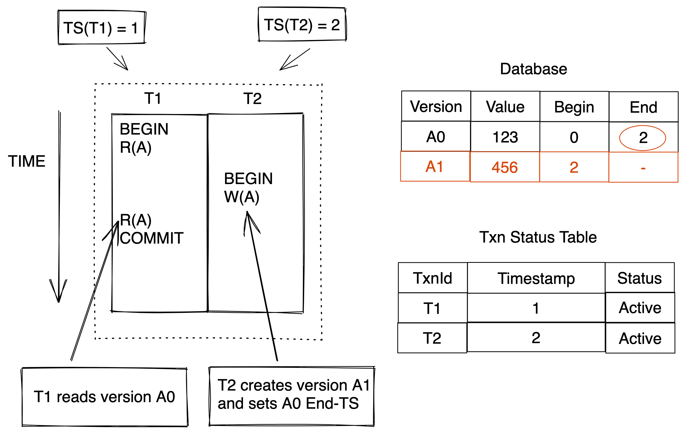
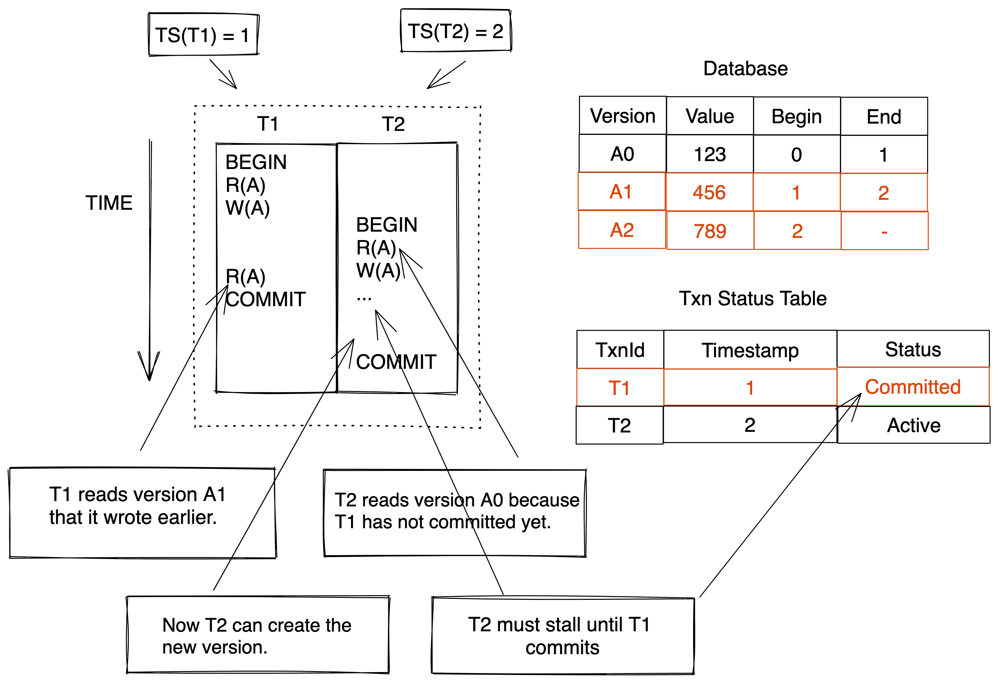
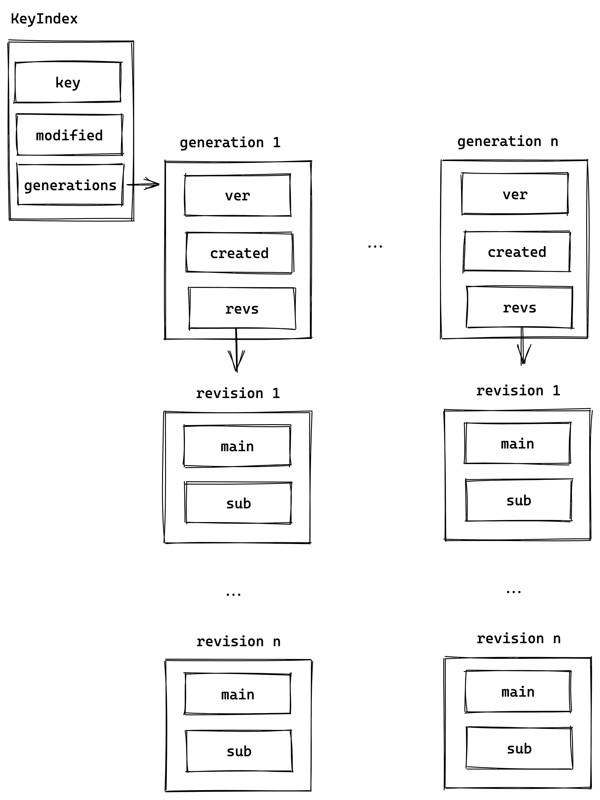
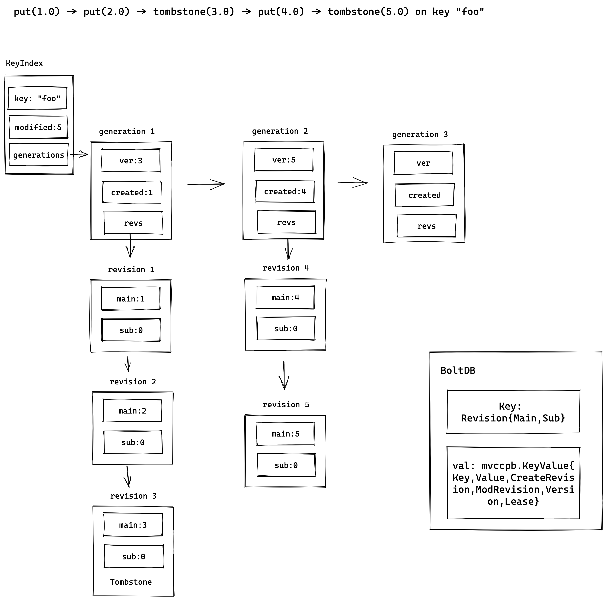

## Multi-Version Concurrent Control with etcd.

### What's MVCC

**Background**
MVCC is the most widely used scheme in DBMSs. It's now used in almost every new DBMS implemented in last 10 years.

**Figure1**



Look at Figure1, with mvcc the system maintains multiple physical versions (A0, A1) of a single logical object (A). When a transaction write to an object, the system will creates a new version of that object (When T2 BEGIN and execute W(A), it creates version A1 and sets A0 End-TS). When a transaction reads an object, it reads the newest version that existed when the transaction started (T1 reads version A0).

**Figure2**


Figure 2 is another example, When T1 BEGIN, The A value in this system is A0 - 123, now T1 start and R(A) read the version AO, then T1 W(A) write a new version A1 to system and set A0 End-TS to 1. Then, T1 call R(A) again, it will reads version A1 that it wrote eralier.

After T1 W(A), T2 start, T2 call R(A), it reads version A0 of A, because T1 has not committed yet. then T2 call W(A), it will stall until T1 committed. After T1 committed, it create a new version A2, and set A1 End-TS to 2, set A2 start version to 2.

**Benefit of MVCC**

Writers do not block readers and readers do not block reads. This means that one transaction can modify an object while other transations read old versions.

### MVCC in etcd

We can find etcd mvcc implementation in directory https://github.com/etcd-io/etcd/tree/main/server/storage/mvcc



The `Revision` struct representation a MVCC version in etcd. 
```
type Revision struct {
	// Main is the main revision of a set of changes that happen atomically.
	Main int64
	// Sub is the sub revision of a change in a set of changes that happen
	// atomically. Each change has different increasing sub revision in that
	// set.
	Sub int64
}
```

The `Main` corresponds to the transaction ID, which is globally incremented and not duplicated. It is used as a logical clock in etcd. `Sub` represents the number of different modification operations (such as Put, Del) in a transaction. It also  globally incremented and represents the sub operation sequence.

The `keyIndex` stores the revisions of a key in the backend.

```
type keyIndex struct {
	key         []byte
	modified    Revision // the main rev of the last modification
	generations []generation
}
```

```
type generation struct {
	ver     int64
	created Revision // when the generation is created (put in first revision).
	revs    []Revision
}
```
Each keyIndex has at least one key `generation`. 

One `generation` represent the process from when the key is created to it been deleted.

When etcd recived a delete rpc call, it will label a BucketKey with tombstone. `Tombstone` on a key appends an tombstone version at the end of the current generation and creates a new empty generation. 

Each version of a key has an index pointing to the bachend. 



Compact a keyIndex removes the versions with smaller or equal to rev except the largest one. If the generation becomes empty during compaction, it will be removed. if all the generations get removed, the keyIndex should be removed.

```
 For example:
    compact(2) on the previous example
 generations:

	{empty}
	{4.0, 5.0(t)}
	{2.0, 3.0(t)}

   compact(4)
   generations:
 
 	{empty}
 	{4.0, 5.0(t)}

   compact(5): 
   generations:

	{empty} -> key SHOULD be removed.

   compact(6):
   generations:
```
