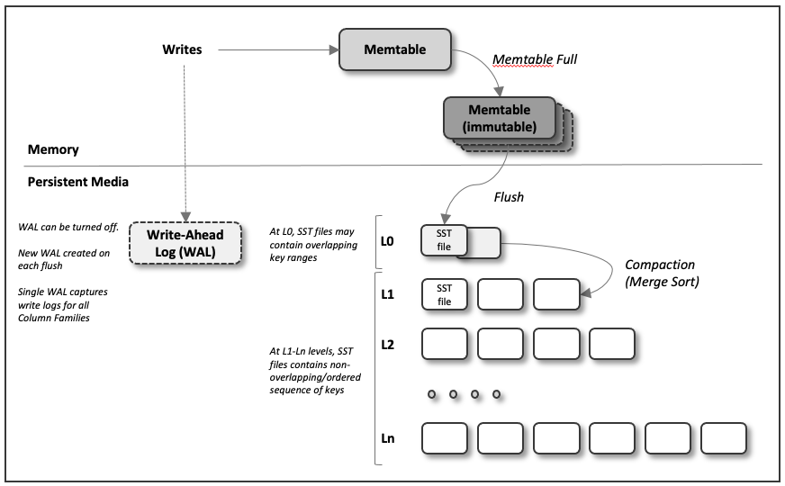

### 1.介绍

RocksDB 是 Facebook 启动的一个存储引擎项目，它用来在各种存储介质运行工作任务，它最开始主要专注于快速存储 (尤其是闪存)。它同时是一个 C++ 库用来存储任意大小字节流的键值对，并且支持了点查 (point lookups) 和范围查询 (range scans)，同时一共了不同类型的 ACID 保证。

作为一个底层存储引擎，rocksdb 一直在可定制化以及自适应之间权衡。Rocksdb 有高度灵活的配置选项，可以通过调整运行在各种生产环境下，包括 SSD 硬盘，ramfs，或者远程存储。它支持各种压缩算法并且具有在生成环境下支持和调试的工具。另一方面，rocksdb 还努力控制这些配置选项的数量，提供了足够好的开箱即用的性能，并且提供了一些自适应的算法。

Rocksdb 从开源 leveldb 项目中借用了重要的代码，并且从 Apache HBase 项目中借鉴了一些思想，最开始的代码是从开源的 leveldb 1.5 开始的。

### 2.设想和目标

#### 性能
Rocksdb 主要的设计目标是要支持高效的点查和范围查询，它需要可以被配置以支持超高流量的随机读和更新，它的架构需要支持不同的工作流和硬件。

#### 生产环境支持
Rocksdb 在设计上应该内建一些工具用来在生产环境下部署和调试程序，如果存储引擎不能适应应用程序和硬件，我们会提供一些可供用户调整性能的参数。

#### 兼容性
新的版本需要向后兼容，这样已经开发好的上层应用在升级到新版本 RocksDB 的时候不需要做修改。如果你需要使用一些新版本的新特性，可以参见 [https://github.com/facebook/rocksdb/wiki/RocksDB-Compatibility-Between-Different-Releases](https://github.com/facebook/rocksdb/wiki/RocksDB-Compatibility-Between-Different-Releases)

### 3.高层次的架构

RocksDB 是一个 kv 存储引擎，他可以存储任意字节流的 kv 数据。RocksDB 按顺序组织了所有数据，它提供的常见操作有 `Get(key)`, `NewIterator()`, `Put(key, val)`, `Delete(key)` 和 `SingleDelete(key)`。

RocksDB 三个基本的组成构件是 memtable, sstfile, 和  logfile。新的写入插入到 memtable 中，同时可选的写入到 logfile (也就是 Write Ahead Log) 中。logfile 在磁盘是一个顺序写的文件。一旦 memtable 写满了，它将会被 flush 成磁盘上的 sstfile，与之相关联的 logfile 可以被安全的删除了。sstfile 中的数据是排序的，以便于快速的查找 key。

sst 文件的详细格式见 [点我](https://github.com/facebook/rocksdb/wiki/Rocksdb-BlockBasedTable-Format)

### 3.特性

#### 列族（Column Families）

RocksDB 支持将一个库分到多个列族里面，所有的库创建的时候都有一个叫做 "default" 的列族，未制定列族时，默认就是操作 default 列族。

RocksDB 在崩溃恢复的时候 (开启了 WAL 以及 atomic flush)，确保了数据一致性。

#### 数据更新（Updates）

`Put` API 插入单个 kv 到数据库，如果 key 已经存在数据库了，原先的值会被覆盖。`Write`  API 允许多个 kv 对可以被原子的插入，更新，或者删除。也就是 Write 的一批操作要么全部插入成功，要么全部插入失败。如果这些 key 已经存在于数据库中，原先的值将会被覆盖，`DeleteRange` 用来批量的删除一批 key。

#### 读取，迭代和快照 (Gets, Iterators and Snapshots)

kv 被组织成任意的字节流。对于 key, value 的大小没有限制。Get API 允许应用从库中读取单个 key、value 对，MultiGet API 允许应用从库中读取一批的 key、value 对。

库里面所有数据按顺序存储，应用可以可以执行 key 的比较方法用来对所有 key 排序。Iterator API 用于应用对数据库作范围扫描。Iterator 还可以 seek 到指定的 key 开始扫描，同时 Iterator 也可以用于对库进行反向迭代。

Snapshot API 允许应用创建数据库快照。Get 和 Iterator API 可以被用来读取指定的快照。

Snapshots 在数据库重启的时候不会持久化：重新加载 RocksDB 的库。

#### 事务 (Transactions)

RocksDB 支持多种可选的事务，他对乐观和悲观模式的事务都支持，详细可以见 [点我](https://github.com/facebook/rocksdb/wiki/Transactions)

#### 前缀迭代 (Prefix Iterators)

#### 持久化 (Persistence)

数据校验 (Data Checksuming)

多线程合并 (Multi-Threaded Compactions)

合并的方式 (Compaction Styles)

元数据存储 (Metadata storage)

避免停顿 [就是 rocksdb 因为写入太快，处理不过来的情况] (Avoiding Stalls)

合并过滤 (Compaction Filter)

只读模式 (ReadOnly Mode)

数据库调试日志 (Database Debug Logs)

数据压缩 (Data Compression)

全备份和复制 (Full Backups and Replication)

支持同进程嵌入多个数据库 (Support for Multiple Embedded Databases in the same process)

块缓存，压缩后和未压缩数据 (Block Cache Compressed and Uncompressed Data)

表缓存 (Table Cache)

